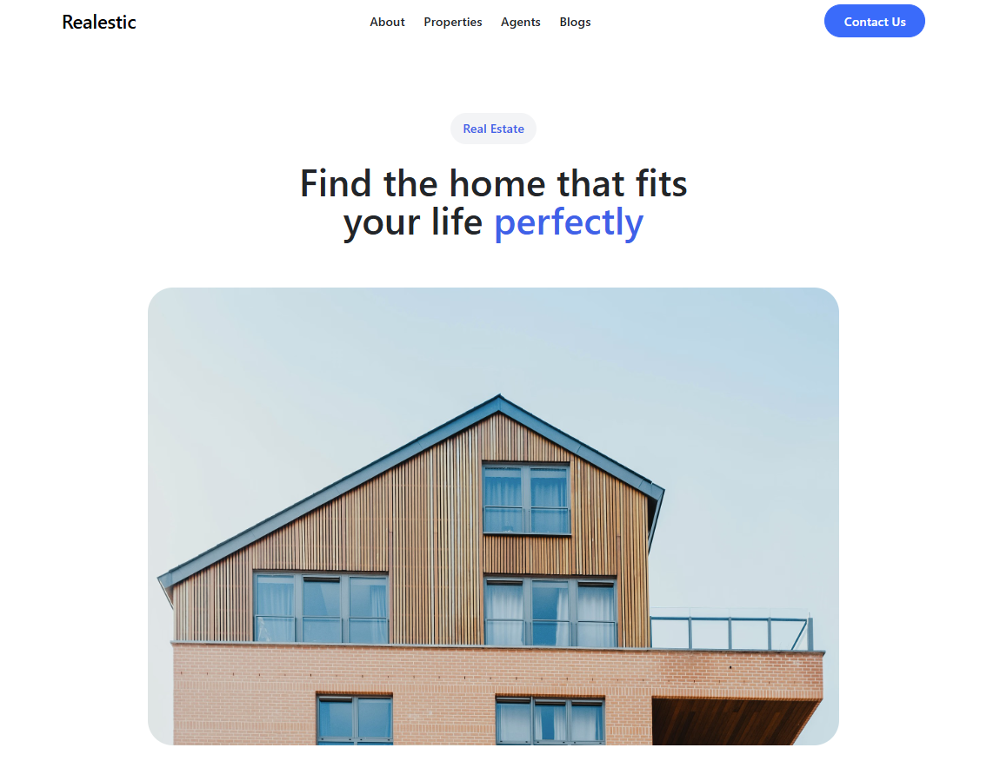

# 🏡 Real Estate React Project

[](https://reactjs.org/)
[](https://tailwindcss.com/)
[](https://reactrouter.com/)
[](https://vercel.com/)

---

## 🔗 Live Demo

Check out the live project here:
[**Real Estate Live**](https://educore-project-5c1g-d803dg0mu-zaid483s-projects.vercel.app/)

---

## 📝 Overview

This is a **modern Real Estate web application** built using **React** and **Tailwind CSS**.
The project focuses on clean design, smooth user experience, and reusable component architecture.

It includes dynamic sections like property listings, testimonials, and multi-page navigation using **React Router**.

---

## ✨ Features

- 📱 Fully **responsive design** (mobile, tablet, desktop)
- 🧭 **Client-side routing** with React Router
- 🏘️ Modern **property listing cards**
- 💬 Interactive **testimonial slider (Splide.js)**
- 🎨 Beautiful UI with **gradients & glassmorphism**
- ♻️ Clean and **reusable components structure**
- ⚡ Fast and optimized performance

---

## 🛠️ Tech Stack

- **React.js** – Frontend library
- **Tailwind CSS** – Styling framework
- **React Router** – Navigation
- **Splide.js** – Slider functionality
- **Lucide Icons** – Icon system
- **Vercel** – Deployment platform

---

## 📂 Project Structure

```
src/
│── components/
│   ├── Navbar.jsx
│   ├── Slider.jsx
│   ├── Cards.jsx
│   ├── Footer.jsx
│
│── pages/
│   ├── Home.jsx
│   ├── About.jsx
│   ├── Contact.jsx
│
│── data/
│   ├── Sliderdata.js
│
│── assets/
│
│── App.jsx
│── main.jsx
```

---

## 🧭 Routing

This project uses **React Router** for seamless navigation between pages without reloading.

Example routes include:

- `/` → Home Page
- `/about` → About Page
- `/contact` → Contact Page

---

## 🚀 Deployment

This project is deployed on **Vercel**. Access it here:
[**Real Estate Live**](real-estate-react-2ww4.vercel.app)

---

## 📸 Screenshot



---

## 👤 Author

**Zaid Afzalzada** – [GitHub Profile](https://github.com/zaid483)

---

## ⭐ Support

If you like this project, consider giving it a ⭐ on GitHub — it really helps!

---
